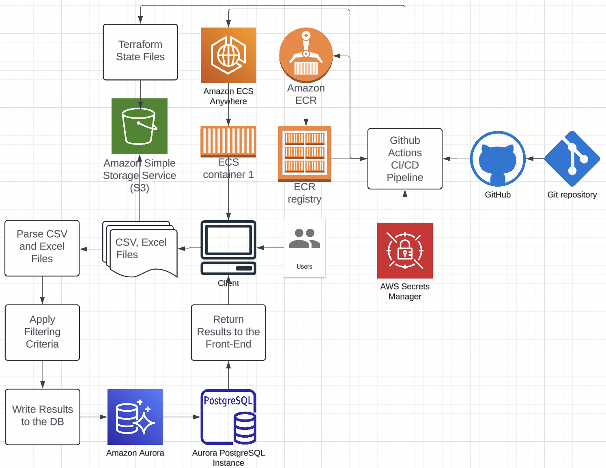

# Dividend Investing Automation Application

## Overview

This application is an AWS-hosted dividend investing automation tool designed to analyze stock data, provide investment recommendations, and visualize results. It combines a Python Flask backend with a NextJS React with Typescript frontend to offer a powerful, user-friendly interface for dividend investors.

## Features

- File upload (CSV/Excel) for stock data analysis
- Automated data parsing and criteria application using pandas
- Results storage in AWS Aurora PostgreSQL database
- Interactive dashboard with React
- Historical data comparison for buy/sell recommendations
- AWS S3 integration for file storage
- Containerized deployment on AWS ECS
- CI/CD pipeline with GitHub Actions
- Infrastructure as Code using Terraform

## Architecture



The above diagram illustrates the overall architecture of our Dividend Investing Automation Application. It shows the flow of data from user input through various AWS services and how different components interact.

### Backend

- **Framework**: Flask
- **Language**: Python
- **ORM**: SQLAlchemy
- **Database**: AWS Aurora PostgreSQL
- **File Processing**: pandas

### Frontend

- **Dashboard**: NextJS - React
- **Language**: Typescript

### Infrastructure

- **Cloud Provider**: AWS
- **Container Orchestration**: ECS
- **Container Registry**: ECR
- **File Storage**: S3
- **Secrets Management**: AWS Secrets Manager

### DevOps

- **Version Control**: GitHub
- **CI/CD**: GitHub Actions
- **Infrastructure as Code**: Terraform
- **Containerization**: Docker

## Trello Board

[Trello Board](https://trello.com/invite/b/670c16ca5028297ed761f6e2/ATTIa53315db854e649a568539e0e08d28455EED5C99/dividend-automation-application)

## Setup and Installation

1. Clone the repository:

   ```bash
   git clone https://github.com/cobriensr/dividend-investing-automation.git
   cd dividend-investing-automation
   ```

2. Set up a virtual environment:

   ```bash
   python -m venv venv
   source venv/bin/activate  # On Windows use `venv\Scripts\activate`
   ```

3. Install dependencies:

   ```bash
   pip install -r requirements.txt
   ```

4. Set up AWS credentials:
   - Create an AWS account if you don't have one
   - Configure AWS CLI with your credentials

5. Set up Terraform:
   - Install Terraform
   - Initialize Terraform:

     ```bash
     terraform init
     ```

6. Deploy infrastructure:

   ```bash
   terraform apply
   ```

7. Build and push Docker image:

   ```bash
   docker build -t dividend-investing-app .
   docker push your-ecr-repo/dividend-investing-app:latest
   ```

8. Deploy to ECS:
   - This step is automated via GitHub Actions upon pushing to the main branch

## Usage

1. Access the application URL provided by ECS
2. Upload a CSV or Excel file containing stock data
3. View the analysis results and recommendations on the dashboard
4. Explore historical data and trends

## Development

### Running Tests

```bash
pytest
pytest --html=report.html --cov=app
```

### Local Development

1. Set up a local PostgreSQL database
2. Update `config.py` with local database credentials
3. Run the Flask development server:

   ```bash
   flask run
   ```

## Contributing

1. Fork the repository
2. Create a new branch (`git checkout -b feature/AmazingFeature`)
3. Commit your changes (`git commit -m 'Add some AmazingFeature'`)
4. Push to the branch (`git push origin feature/AmazingFeature`)
5. Open a Pull Request

## Future Enhancements

- Integration of AI/ML models for advanced data analysis
- Enhanced visualization options
- Real-time data feeds
- Mobile application

## License

This project is licensed under the MIT License - see the [LICENSE.md](LICENSE.md) file for details.

## Acknowledgments

- [Flask](https://flask.palletsprojects.com/)
- [React](https://react.dev/)
- [Next](https://nextjs.org/)
- [pandas](https://pandas.pydata.org/)
- [SQLAlchemy](https://www.sqlalchemy.org/)
- [Terraform](https://www.terraform.io/)
- [AWS](https://aws.amazon.com/)
